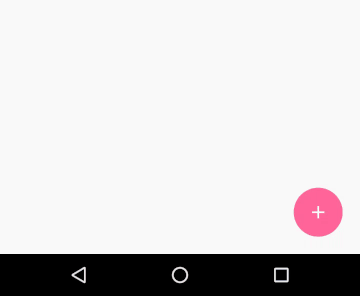

#This is still a work in progress

This repo contains two features that might be separated into two libraries in future

**FissionColony**, a FloatingActionButton with organic animations

and 

**FanoutButton**, a FloatingActionButton that expands to display multiple buttons when clicked


FanoutButton
============



Usage

```
<com.eo5.amoeba.views.FanOutButton
        android:layout_width="wrap_content"
        android:layout_height="wrap_content"
        android:layout_gravity="bottom|end"
        android:layout_margin="@dimen/fan_margin"
        app:fan_margin="@dimen/fan_margin2"
        app:fan_elevation="0dp"
        app:fan_enable_backdrop="true"
        app:fan_main_icon="@drawable/ic_add"
        app:fan_angled_icon="@drawable/ic_food"
        app:fan_left_icon="@drawable/ic_movies"
        app:fan_top_icon="@drawable/ic_location"
        app:fan_start_rotation="@integer/start_rot"
        app:fan_end_rotation="@integer/end_rot"/>

```

==============
###Features not yet completely implemented

```
fan_elevation
```
```
fan_enable_backdrop
```